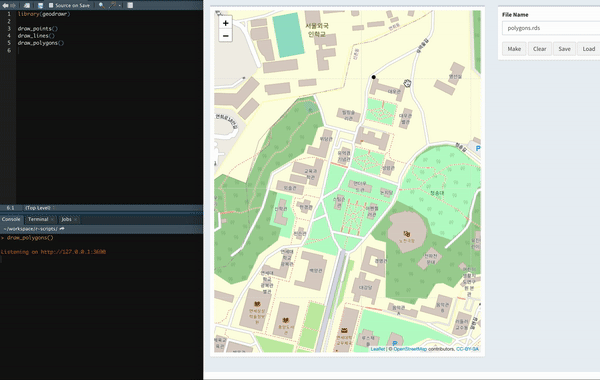
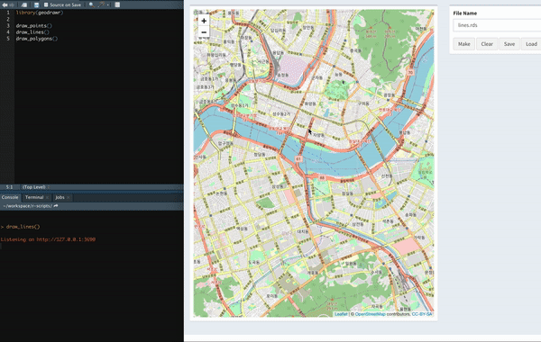
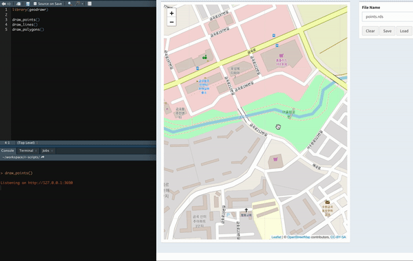

<!-- README.md is generated from README.Rmd. Please edit that file -->
geodrawr
========

An interactive tool for making geo-spatial objects by clicks on the map

Installation
------------

You can install the released version from [GitHub](https://github.com/) with:

``` r
# install.packages("devtools")
devtools::install_github("Curycu/geodrawr")
```

How to Use?
-----------

There are three draw tools :

``` r
library(geodrawr)

# draw_polygons()
# draw_lines()
# draw_points()
```

#### case polygons

<<<<<<< HEAD
  
\- click the map to make edges  
\- push **Make** button to make a polygon from the edges  
\- push **Save** button to save polygons as rds file  
\- push **Load** button to load polygons from rds file

#### case lines

  
\- click the map to make edges  
\- push **Make** button to make a line from the edges  
\- push **Save** button to save lines as rds file  
\- push **Load** button to load lines from rds file

#### case points

  
\- click the map to make a point  
\- push **Save** button to save points on the map as a rds file  
\- push **Load** button to load points from rds file
=======
-   click the map to make edges
-   push Make button for polygon completion
-   click the map to start to making an another polygon
-   push Save button for save complete polygons as rds file
-   push Load button for load polygons from rds file

#### case lines

-   click the map to make edges
-   push Make button for line completion
-   click the map to start to making an another line
-   push Save button for save complete lines as rds file
-   push Load button for load lines from rds file

#### case points

-   click the map to make points
-   push Save button for save points as rds file
-   push Load button for load points from rds file
>>>>>>> ac523b3220a27c0c00066a9ceb37d668428a55de
